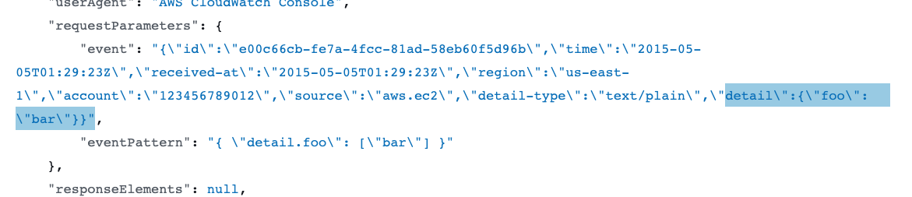
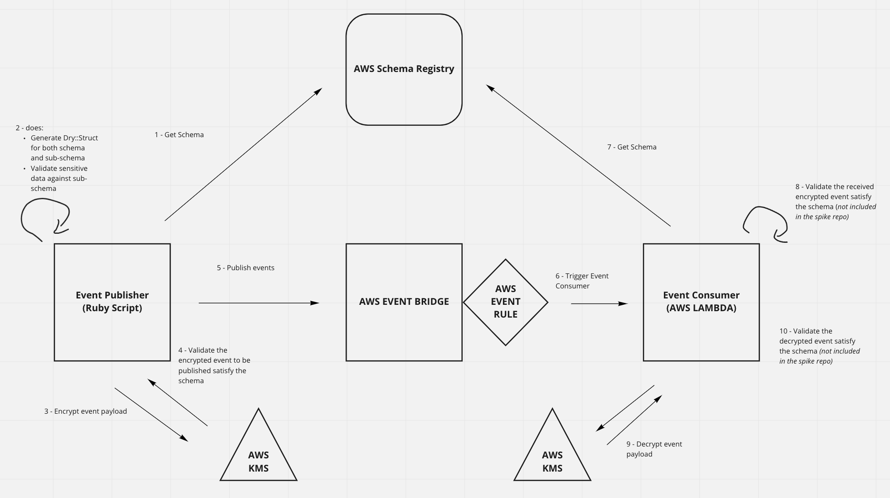

# Event bridge schema POC

This repo is to spike the event bridge schemas where events have encrypted blobs

> If we were to use event bridge as an event bus, we need to use the event bridge schema registry to define the format of our events for relevant services to consume. Given that we can't have guarantee of event payloads being encrypted, we need to be able to bake encrypted payloads into our event schemas ourselves, but how do we define the schema of the encrypted blob (within the schema definition stored in the registry) so that consumers can know what they are consuming

The main reason for encrypting the payload of the event is that we don’t trust EventBridge for handling sensitive data.

> Any data that you enter into EventBridge or other services might get picked up for inclusion in diagnostic logs.
> https://docs.aws.amazon.com/eventbridge/latest/userguide/data-protection.html




## Proposal

See the `schema.json` on the proposed idea of using JSON schema Draft 4 to embed a `sub-schema` so that the encrypted schema can link back to the decrypted schema.

In this example, EncryptedSomethingSensitive#schema references the actual class (our sub-schema), but not an instance.

Main drawback: we will have to implement a layer to handle the “sub-schema“ validation

Doesn’t seem to be another approach till JSON Schema specification doesn’t provide a solution out of the box.

## System Diagrams



## Setup

* [AWS SAM](https://docs.aws.amazon.com/serverless-application-model/latest/developerguide/serverless-sam-cli-install.html)

For the spike, I've manually created the following resources:
* KMS event-consumer-test
* EventRegistry rules pattern
* Generated SAM cloudformation - event consumer lambda

### Cleanup

Manually remove following AWS resources:
* KMS event-consumer-test
* EventRegistry rules pattern
* Generated SAM cloudformation - event consumer lambda


## Event Publisher

To run the app to publish event to AWS Event Bridge (to default event bus):
1. `bundle install`
2. run `awsauth` and use the dev env
3. run `ruby main.rb`

Use `binding.pry` to pry around the code :)

## Event Consumer

This uses AWS SAM to setup lambda function that is triggered based on the event rules pattern on:
```
{
  "source": [
    "test"
  ]
}
```

To deploy changes of AWS SAM, which will create/update the cloudformation, run:
```
awsauth
sam build && sam deploy
```

To verify thatt the lambda is consuming the event, check the cloudwatch of the AWS Lambda to verify the consumer is behaving as intended.
